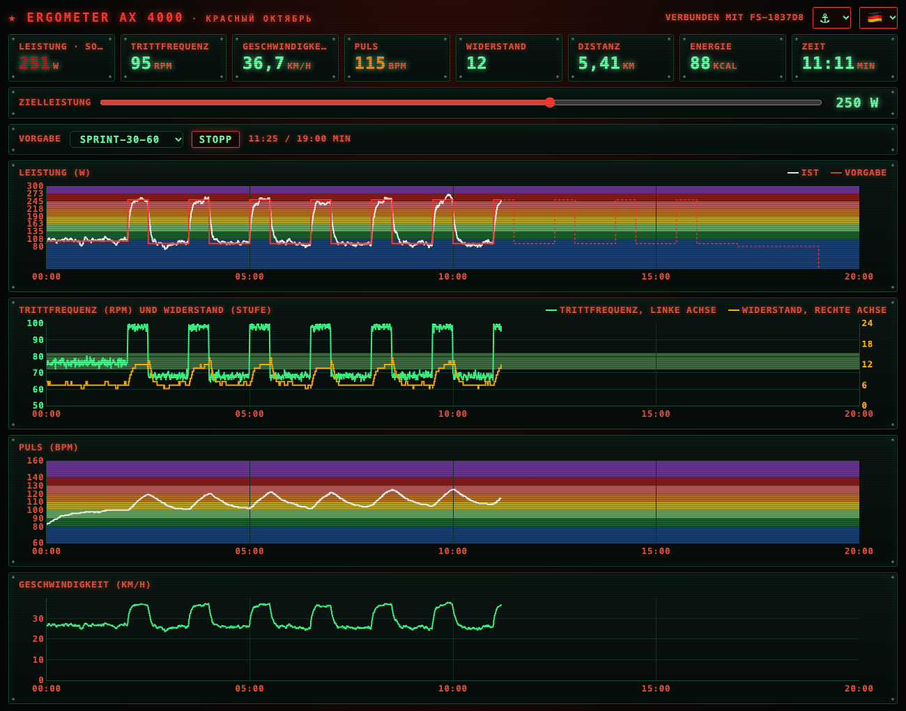

# Ergometer

Verbindet sich per Bluetooth LE mit einem Christopeit AX 4000 Ergometer, zeigt die Messwerte live an und regelt auf Wunsch eine Zielleistung.

- Messwerte in der Konsole: Geschwindigkeit, Trittfrequenz, Leistung, Widerstand, Distanz, Energie, Puls, Zeit
- Cockpit im Browser mit Kacheln und Plotly-Verlaufskurven
- Zielleistung in Watt: ein PID-Regler im Programm stellt dazu die Widerstandsstufe des Ergometers nach
- Leistungsvorgaben aus Dateien (Intervalle, Stufentest) und Aufzeichnung jeder Fahrt als CSV
- Handy als Fernbedienung: QR-Code scannen, dann Vorgabe, Start und Stopp am Ergometer bedienen



*Das Cockpit während der Vorgabe `sprint-30-60`, hier mit simulierten Messwerten.*

## Installation

Voraussetzungen:

- ein Mac mit Bluetooth in Reichweite des Ergometers (wenige Meter)
- [uv](https://docs.astral.sh/uv/) – es besorgt Python und die einzige Abhängigkeit `bleak` beim ersten Start von selbst
- Internetverbindung für das Cockpit, am Mac wie am Handy (Plotly wird von einem CDN geladen)
- für die Fernbedienung: ein Handy im selben WLAN wie der Mac

Einmalig einrichten:

1. uv installieren, falls es fehlt:

   ```
   brew install uv
   ```

   Ohne Homebrew: `curl -LsSf https://astral.sh/uv/install.sh | sh`

2. Das Programm holen:

   ```
   git clone https://github.com/HelmutQualtinger/Ergometer.git ~/Ergometer
   ```

3. Prüfen, ob der Mac das Ergometer sieht. Dazu ein paar Umdrehungen treten, damit es aufwacht, dann:

   ```
   cd ~/Ergometer
   uv run ergometer.py --scan
   ```

   Beim ersten Mal fragt macOS, ob das Terminal Bluetooth verwenden darf – erlauben. Wurde die Frage abgelehnt, lässt sich das unter Systemeinstellungen → Datenschutz & Sicherheit → Bluetooth nachholen. In der Liste erscheint das Ergometer unter dem Namen seines FitShow-Moduls, z. B. `FS-1837D8`.

Mehr ist nicht zu installieren: kein Build-Schritt, und auf dem Handy keine App – es benutzt seinen Browser (siehe [Handy als Fernbedienung](#handy-als-fernbedienung)).

## Starten

```
cd ~/Ergometer
uv run ergometer.py --panel
```

Das Programm sucht das Ergometer, verbindet sich und öffnet das Cockpit unter http://127.0.0.1:8050/. Im Terminal stehen dazu die Adresse für das Handy und ihr QR-Code. Beenden mit Ctrl+C; eine laufende Aufzeichnung wird dabei gespeichert.

Das Ergometer nimmt nur eine Bluetooth-Verbindung gleichzeitig an: Vor dem Start andere Apps (z. B. Kinomap) trennen und ein paar Umdrehungen treten, damit es aufwacht. Aus demselben Grund kann das Programm nur einmal laufen; ein zweiter Start scheitert mit `Address already in use`.

## Optionen

| Option | Bedeutung |
|---|---|
| `--panel` | Cockpit im Browser anzeigen |
| `--port N` | Port für das Cockpit (Standard: 8050) |
| `--power W` | Zielleistung in Watt schon beim Start vorgeben |
| `--profile DATEI` | Leistungsvorgabe aus einer Datei laden; sie startet, sobald das Ergometer verbunden ist |
| `--scan` | nur die Bluetooth-Geräte in der Nähe auflisten |
| `--name TEXT` | Gerät mit diesem Namensbestandteil suchen |
| `--address ID` | mit einem bestimmten Gerät verbinden (auf macOS eine UUID) |
| `--timeout S` | Suchdauer in Sekunden (Standard: 10) |
| `--raw` | zusätzlich die Rohdaten aller übrigen Benachrichtigungen ausgeben |

Ohne `--panel` gibt es nur die Konsolenausgabe.

## Cockpit

- Kacheln mit den aktuellen Werten, darunter Verlaufskurven für Leistung, Trittfrequenz, Geschwindigkeit und Puls über die letzten 20 Minuten
- Die Pulskurve liegt auf farbigen Zonen von 60 bis 160 bpm, die Leistungskurve auf denselben acht Farben, gleichmäßig verteilt von 80 bis 300 W. Die Kacheln für Puls und Leistung zeigen ihren Wert in der Farbe der aktuellen Zone.
- Im Leistungsdiagramm ist die Vorgabe eine fette weiße Linie, die gemessene Leistung liegt schwarz darüber.
- Die Kachel „Temperatur" zeigt die Raumtemperatur. Das Programm liest sie per MQTT von einem Sensor. Adresse und Topic des Brokers stehen in der Datei `.env` neben dem Programm (`MQTT_HOST`, `MQTT_PORT`, `MQTT_TOPIC`); sie gehört nicht ins Repository. Als Vorlage dient `.env.example`: kopieren (`cp .env.example .env`) und ausfüllen. Fehlt `MQTT_HOST` oder `MQTT_PORT`, entfällt die Kachel. Feld und Korrektur stehen als Konstanten `MQTT_FIELD` und `MQTT_OFFSET` oben in `ergometer.py`.
- Oben rechts lassen sich Erscheinungsbild und Sprache umschalten.
- Solange das Programm läuft, bleiben Bildschirmschoner und Ruhezustand des Macs aus (`caffeinate`).

## Handy als Fernbedienung

Der Mac steht meist nicht in Griffweite des Sattels. Das Handy am Lenker zeigt deshalb dasselbe Cockpit in seinem Browser: Vorgabe wählen, Start, Stopp und Zielleistung lassen sich direkt am Ergometer bedienen. Eine App ist dafür nicht nötig. Das Handy spricht nur mit dem Programm auf dem Mac; die Bluetooth-Verbindung zum Ergometer hält weiterhin der Mac.

### Einrichten (einmalig)

1. Das Handy ins selbe WLAN bringen wie den Mac.
2. Am Mac das Programm mit `--panel` starten. Fragt die macOS-Firewall nach eingehenden Verbindungen, „Erlauben" wählen.
3. Den QR-Code mit der Kamera des Handys scannen. Er steht im Terminal und im Cockpit am Mac; der Knopf 📱 oben rechts blendet ihn dort ein und aus. Ohne Kamera geht es auch von Hand: Die Adresse steht im Terminal in der Zeile `Phone:` und im Cockpit neben dem QR-Code.
4. Die Seite als Lesezeichen sichern oder auf den Home-Bildschirm legen (iPhone: Teilen → „Zum Home-Bildschirm"; Android/Chrome: Menü ⋮ → „Zum Startbildschirm hinzufügen"). Danach ist kein Scannen mehr nötig.
5. Die Bildschirmsperre des Handys für die Fahrt verlängern oder abschalten (iPhone: Einstellungen → Anzeige & Helligkeit → Automatische Sperre). Das Cockpit hält den Bildschirm des Handys nicht selbst wach.

### Im Betrieb

- Zuerst das Programm am Mac starten, dann das Cockpit am Handy öffnen. Läuft das Programm nicht, bleibt die Seite am Handy leer.
- Mac und Handy zeigen denselben Stand und lassen sich gleichzeitig bedienen: Was am Handy gestartet wird, läuft auch am Mac, und umgekehrt. Die Seite kann am Handy jederzeit geschlossen und neu geöffnet werden; die Fahrt und ihre Kurven bleiben erhalten, denn sie liegen im Programm.
- Am Handy rückt der Countdown bis zum nächsten Leistungswechsel in eine eigene Zeile und wird groß genug, um ihn vom Sattel aus zu lesen.
- Für die Pieptöne am Handy die Seite einmal antippen (z. B. den Knopf 🔔); vorher spielt der Browser keinen Ton. Am iPhone muss außerdem der Stummschalter aus sein.
- Erscheinungsbild, Sprache, Ton und die Anzeige des QR-Codes merkt sich jedes Gerät für sich. Beides lässt sich auch in der Adresse festlegen, z. B. `http://192.168.1.184:8050/?theme=dark&language=en`.
- Der Mac muss wach bleiben: Das Programm verhindert den Ruhezustand, solange es läuft, aber ein zugeklapptes MacBook schläft trotzdem ein.

### Wenn das Handy das Cockpit nicht öffnet

| Anzeichen | Ursache und Abhilfe |
|---|---|
| Seite lädt nicht | Das Handy ist nicht im selben WLAN (Mobilfunk, Gastnetz) – ins Heimnetz wechseln. Viele Gastnetze trennen die Geräte voneinander. |
| Seite lädt nicht, WLAN stimmt | Die macOS-Firewall blockt: Systemeinstellungen → Netzwerk → Firewall → Optionen, dort eingehende Verbindungen für Python erlauben. |
| Lesezeichen geht nicht mehr | Der Mac hat vom Router eine neue Adresse bekommen. Neu scannen; dauerhaft hilft eine feste Adresse für den Mac im Router (DHCP-Reservierung). |
| QR-Code zeigt `127.0.0.1` | Der Mac hatte beim Start kein Netz. WLAN verbinden und das Programm neu starten. |
| QR-Code zeigt eine fremde Adresse | Ein VPN am Mac war beim Start aktiv. VPN trennen und das Programm neu starten. |
| Kacheln da, Diagramme fehlen | Das Handy hat kein Internet; Plotly kommt von einem CDN. |

### Sicherheit

- Der QR-Code enthält nur die Adresse des Cockpits im Heimnetz (z. B. `http://192.168.1.184:8050/`). Mit `--port N` ändert sich die Adresse entsprechend.
- Es gibt keine Anmeldung: Jedes Gerät im selben Netz kann das Cockpit öffnen und das Ergometer bedienen.
- Die Verbindung ist unverschlüsseltes HTTP und nur für das eigene Heimnetz gedacht.

## Leistungsvorgabe aus einer Datei

Das Menü „Vorgabe" im Cockpit bietet alle Dateien `vorgabe-<name>.csv` an, die im selben Verzeichnis wie das Programm liegen; neue Dateien erscheinen dort von selbst. „Start" beginnt das Profil, „Stopp" beendet es und schaltet die Regelung aus. Steht das Menü auf „manuell", beginnt „Start" eine Fahrt mit der Leistung, die der Schieber „Zielleistung" zeigt; der Schieber lässt sich während der Fahrt verstellen, ohne sie zu beenden. Während das Profil läuft, zeigt das Leistungsdiagramm die kommenden zwei Minuten als gepunktete weiße Linie. Rechts neben „Stopp" läuft ein Countdown bis zum nächsten Leistungswechsel, mit dem Wert, auf den es geht (z. B. „0:42 ↗ 150 W"). In den letzten 10 Sekunden piept es einmal pro Sekunde, beim Wechsel selbst einmal länger und höher. Der Knopf 🔔 oben rechts schaltet den Ton aus und ein; ein Browser spielt Ton erst, nachdem die Seite einmal angetippt oder angeklickt wurde. Wer den Schieber „Zielleistung" bewegt, übernimmt von Hand und hält das Profil an.

Die Datei hat zwei Spalten, Zeit (`mm:ss`) und Watt, getrennt durch Komma, Semikolon oder Tabulator. Jede Zeile gilt ab ihrer Zeit bis zur nächsten; eine letzte Zeile mit 0 Watt beendet das Profil. Eine Kopfzeile ist erlaubt.

```
zeit,watt
00:00,80
02:00,200
02:15,100
25:00,0
```

Mitgeliefert sind sechs Profile:

- `vorgabe-hit.csv` (25 Minuten): 21 Zyklen aus 15 Sekunden bei 200 W und 45 Sekunden bei 100 W, davor und danach 2 Minuten bei 80 W
- `vorgabe-intervall-1-3.csv` (24 Minuten): 5 Zyklen aus 1 Minute bei 200 W und 3 Minuten bei 100 W, davor und danach 2 Minuten bei 80 W
- `vorgabe-sprint-30-60.csv` (19 Minuten): 10 Zyklen aus 30 Sekunden bei 250 W und 60 Sekunden bei 90 W, davor 2 Minuten bei 100 W, danach 2 Minuten bei 80 W
- `vorgabe-persoenlich-30.csv` (30 Minuten): 3 Blöcke von 5 Minuten bei 200 W mit 2 Minuten bei 120 W dazwischen, 6 Minuten Einfahren in drei Stufen, 5 Minuten Ausfahren; aus einem Stufentest abgeleitet (85 % von 236 W)
- `vorgabe-stufen-4x.csv` (30 Minuten): 4 Durchgänge mit stufenweisem Anstieg über 120, 150, 180 und 210 W (je 90 Sekunden), davor und danach 3 Minuten bei 100 W; aus einem Stufentest abgeleitet (51 bis 89 % von 236 W)
- `vorgabe-stufentest.csv` (35 Minuten): ab 100 W alle 3 Minuten 25 W mehr, bis 350 W, danach 2 Minuten bei 80 W

## Aufzeichnung

Zwischen „Start" und „Stopp" werden alle Messwerte des Ergometers aufgezeichnet. Auch die Kurven im Cockpit laufen nur in dieser Zeit: Vor dem Start stehen die Diagramme bei 00:00 und nur die Kacheln zeigen die aktuellen Werte, nach dem Stopp bleiben die Kurven stehen. Beim Stopp – auch wenn das Profil von selbst endet, der Schieber übernimmt, die Verbindung abbricht oder das Programm beendet wird – entsteht daraus `logs/log-<jj-mm-tt-hh-mm-ss>.csv`, benannt nach dem Startzeitpunkt. Die Datei enthält je Messung eine Zeile mit Uhrzeit, Sekunden seit dem Start, Zielleistung und den gemeldeten Werten (Geschwindigkeit, Trittfrequenz, Widerstand, Leistung, Puls ...).

## Stufentest auswerten

```
python3 stufentest.py --age 50 --weight 80 --betablocker
```

Das wertet die jüngste Aufzeichnung in `logs/` als Stufentest aus (oder eine als Argument genannte Datei) und schreibt daneben `stufentest-<jj-mm-tt-hh-mm-ss>.html` mit Plotly-Diagrammen:

- maximale Leistung und daraus geschätzte VO₂max
- Einordnung in die gemessenen Verteilungen von Männern desselben Alters, mit Quantilen: FRIEND-Register (USA, Kaminsky et al. 2022) und SHIP (Deutschland, Koch et al. 2009)
- Puls gegen Leistung mit Ausgleichsgerade, dazu Leistungs- und Pulsverlauf und die Stufentabelle

`--height` (cm) legt die BMI-Gruppe der deutschen Vergleichsdaten fest. `--betablocker` schaltet die Beurteilung des Pulses ab. `--pdf` schreibt zusätzlich ein kompaktes, zweispaltiges PDF im Hochformat (braucht Google Chrome). Die Vergleichsdaten gelten nur für Männer. In Claude Code erledigt der Skill `stufentest` dasselbe.

## Lauf ansehen

`python3 lauf.py logs/log-A.csv logs/log-B.csv` zeigt eine oder mehrere Aufzeichnungen als eine Fahrt: Leistung und Puls über die gefahrene Zeit, die Lücken zwischen den Aufzeichnungen, Summen je Aufzeichnung und Mittelwerte je Vorgabestufe. Die Seite entsteht neben der ersten Datei als `lauf-<jj-mm-tt-hh-mm-ss>.html`.

## Zielleistung und PID-Regler

Im Cockpit stellt der Schieber „Zielleistung" die gewünschte Leistung ein (0 = aus, bis 300 W). Solange keine Fahrt läuft, merkt er sich den Wert nur für den nächsten Start; geregelt wird erst ab „Start". Die Regelung läuft im Programm, nicht im Ergometer:

1. Einmal pro Sekunde wird die gemessene Leistung (Mittel der letzten drei Messwerte) mit dem Ziel verglichen.
2. Der PID-Regler berechnet daraus die Widerstandsstufe (1–24) und sendet sie an das Ergometer.
3. Abweichungen unter 8 W gelten als erreicht, damit der Regler nicht zwischen zwei Stufen pendelt. Eine Stufe entspricht etwa 15–20 W.
4. Unter 20 rpm hält der Regler die Stufe, statt den Widerstand hochzudrehen.
5. Ändert sich die Vorgabe, stellt das Programm die Stufe direkt aus der Watt-Tabelle des Herstellers ein (für die aktuelle Trittfrequenz) und lässt dem Ergometer 3 Sekunden Zeit. Der PID-Regler regelt danach nur noch nach; was er zur Tabelle dazulernen musste, nimmt er zur nächsten Vorgabe mit.

Das Ergometer bestätigt zwar auch eine direkte Watt-Vorgabe über Bluetooth, hält die Leistung dann aber nicht selbst; deshalb regelt das Programm.

Die Abstimmung steht als Konstanten oben in `ergometer.py`:

| Konstante | Bedeutung |
|---|---|
| `PID_KP`, `PID_KI`, `PID_KD` | Verstärkungen (Stufen pro Watt) |
| `PID_DEADBAND` | Mindestabstand zur aktuellen Stufe, bevor verstellt wird |
| `PID_TOLERANCE` | Leistungsabweichung in Watt, die als erreicht gilt |
| `WATT_TABLE` | Watt je Stufe und Trittfrequenz aus dem Handbuch des AX 4000 (20 bis 80 rpm; darüber wird hochgerechnet) |
| `PID_SETTLE` | Wartezeit nach einem Sprung auf eine neue Stufe, bevor der Regler wieder arbeitet |
| `PID_MAX_TRIM` | wie viele Stufen Korrektur zur Tabelle der Regler zur nächsten Vorgabe mitnimmt |
| `MIN_CADENCE` | Trittfrequenz, unter der der Regler pausiert |

## Technik

- Die Messwerte kommen über den Bluetooth-Standard FTMS (Fitness Machine Service, `0x1826`), Merkmal „Indoor Bike Data" (`0x2AD2`).
- Der Widerstand wird über den „Fitness Machine Control Point" (`0x2AD9`) gesetzt. Das AX 4000 landet dabei teils eine Stufe neben dem angeforderten Wert; das Programm liest die gemeldete Stufe zurück und korrigiert.
- `ergometer.py` enthält Bluetooth-Anbindung, PID-Regler und einen kleinen HTTP-Server; `panel.html` ist das Cockpit und holt die Daten jede Sekunde vom Server.
- Den QR-Code erzeugt das Programm selbst, ohne zusätzliche Bibliothek: Byte-Modus, Versionen 1–6, Fehlerkorrektur Q (bis etwa 25 % beschädigte Daten bleiben lesbar). Die Stufe steht als `QR_LEVEL` oben in `ergometer.py` (L, M, Q oder H).
